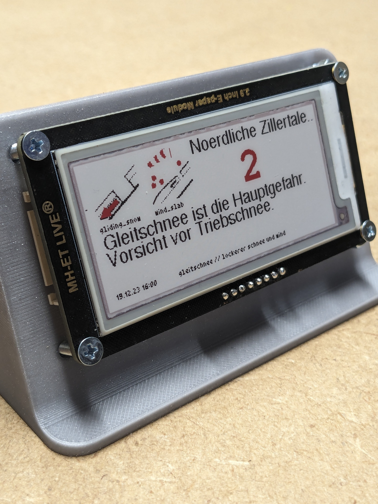
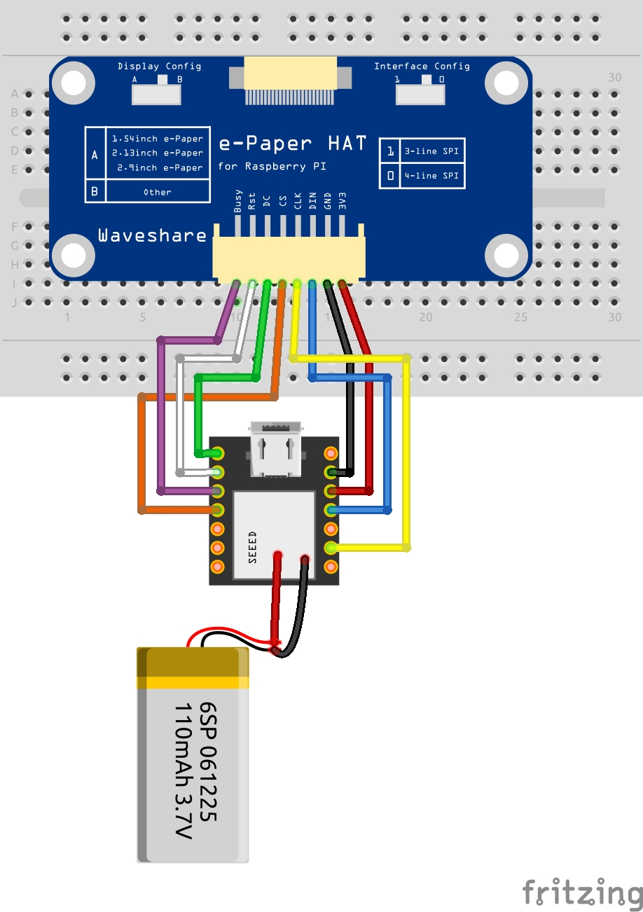

## General info 

|  | |  |
|--------|--------|--------|
|  |  |  |


Aktueller Lawinenlagebericht. Daten werden in einem fixen Zeitintervall aktualisiert und auf einem e-Paper Display dargestellt. 

#### Open-Data
* Sämtliche Daten vom Lawinenlagebericht stammen von: 
    - https://avalanche.report/
    - https://avalanche.report/more/open-data

## Hardware

* ESP32 XIAO
* 3 Color e-Paper 2,9"
* LiPo 600mAH

## Wiring: 



## Programm Aufbau
  * WIFI and MQTT Connection will be established
  * MQTT send to Node-RED 
  * HTTP-Request in Node-RED 
  * Node-RED parses JSON
  * One specific Region is fetched
  * JSON with avalanche data is sent via MQTT to ESP32
  * Show data on E-INK

### Beispiel JSON 
JSON wird am ESP32 per MQTT empfangen und verarbeitet
```JSON
{"region":"Noerdliche Zillertale...","avProblem0":"gliding_snow","avProblem1":"wind_slab","dangerPattern0":"gleitschnee // lockerer schnee und wind","dangerPattern1":"-","publicationTime":"19.12.23 16:00","activityhighlights":"Gleitschnee ist die Hauptgefahr. Vorsicht vor Triebschnee.","tendencyType":"steady","avalancheSize":2}
```

## 3D Design

https://www.printables.com/de/model/687736-29-e-paper-stand

* Simples Design, in dem das 2,9" e-Paper direkt montiert werden kann
* 4x M3 Schrauben
* 4x M3 Muttern als Distanz für eine Seite, die andere Seite hat bei mir einen seitlichen Anschluss für Jumperkabel
* ESP32XIAO und eine LIPO werden einfach reingelegt


Have fun | pixelEDI.eu


Here is a simple flow chart:

